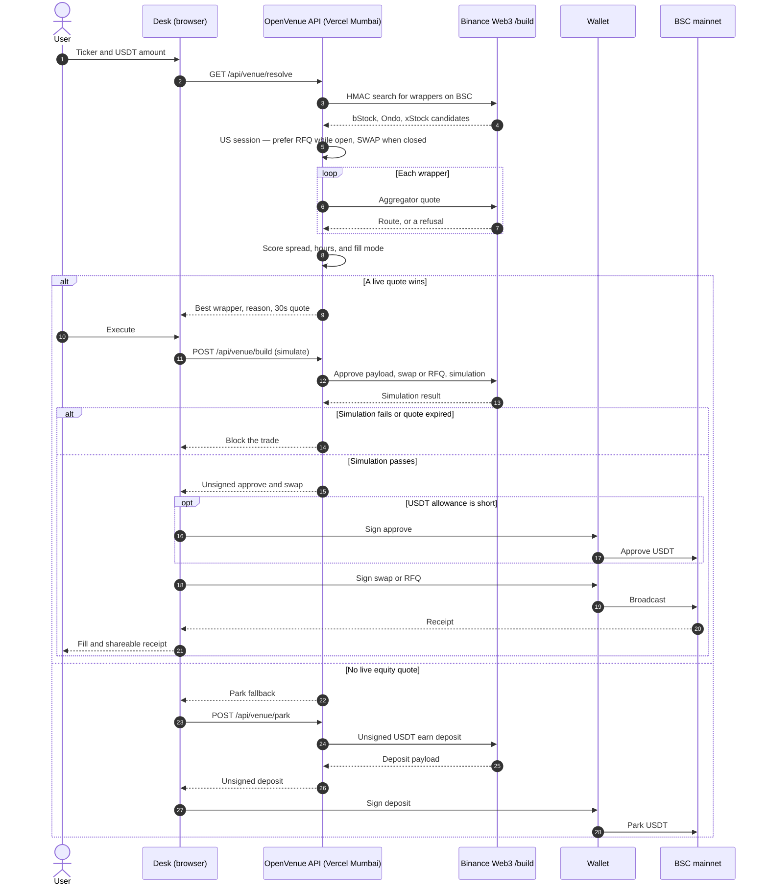
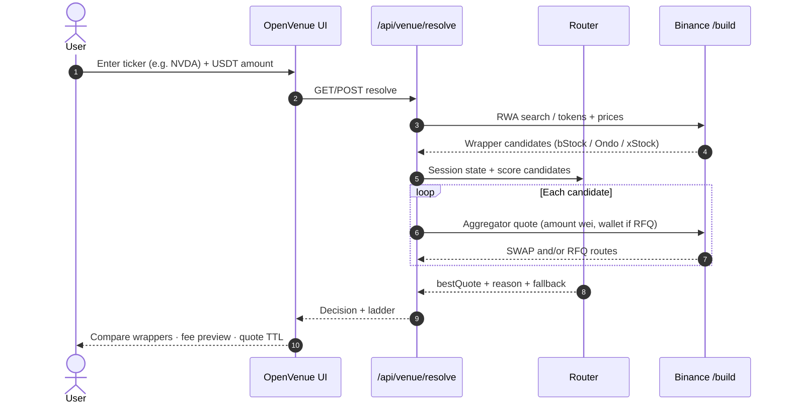
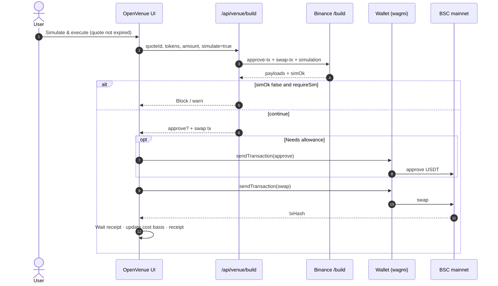
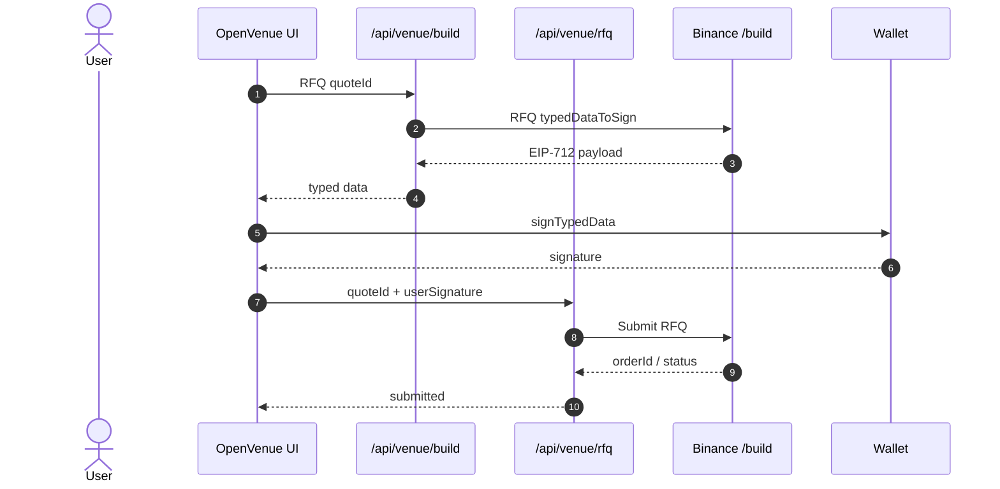
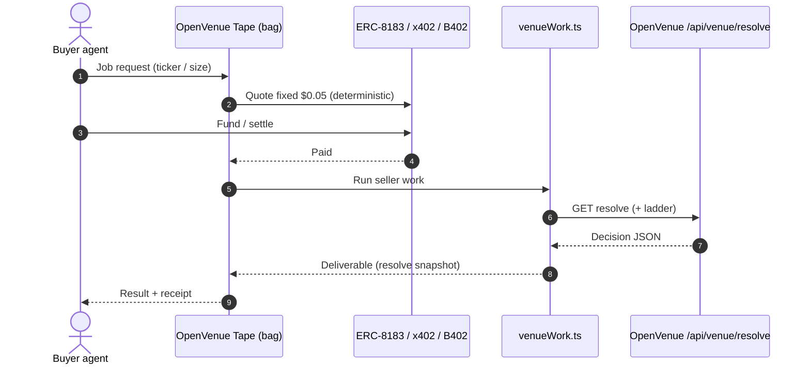

# OpenVenue

**Session-aware tokenized stock desk on BNB Smart Chain.**

Say you want NVDA. OpenVenue finds the live wrapper among **bStocks**, **Ondo**, and **xStocks**, scores SWAP vs RFQ under US market hours, simulates the route, and executes spot on BSC mainnet. When equity venues are quiet, it parks idle USDT in BSC DeFi.

Built for [BNB Hack: Tokenized Stocks Edition](https://www.bnbchain.org/en/hackathons/tokenized-stocks).

Source: [github.com/AmaanSayyad/OpenVenue](https://github.com/AmaanSayyad/OpenVenue)

Live: [openvenue.xyz](https://openvenue.xyz)

---

## What did you build?

**OpenVenue** - a session-aware tokenized stock desk and paid agent tape on **BNB Smart Chain**.

### What it does

- Turns a plain ticker intent (“buy NVDA with USDT”) into a **live multi-wrapper route** across bStocks, Ondo, and xStocks.
- Scores **SWAP vs RFQ** using US equity market hours, spread, and fill quality; simulates before the user signs.
- Executes **spot** swaps / RFQs from a connected wallet on BSC mainnet; confirms fills and updates cost basis.
- Shows explore markets, charts, stats, corporate actions, fee preview, quote expiry, Limit/TWAP, strategies, portfolio, and shareable receipts.
- When equity venues are quiet or spreads blow out, **parks idle USDT** into BSC DeFi earn options.
- Monitors the same resolve engine as **OpenVenue Tape** (~$0.05 / job) so other agents can buy recommendations over ERC-8183 / x402 / B402.

### Who it is for

| Who | Why |
| --- | --- |
| Crypto-native equity traders | One desk instead of three wrapper UIs |
| Session-aware / power users | Watchlist, alerts, TWAP, strategies, corporate-action banners |
| Idle USDT holders | One-tap park when markets are closed |
| Agent builders & A2A buyers | Paid OpenVenue Tape deliverable from the same resolve API |
| Hackathon reviewers | Runnable mainnet demo + DX report |

Spot only. No perps. Users fund their own wallets.

### Binance Web3 APIs used

Signed calls go through the [Web3 Developer Portal](https://web3.binance.com/en/dev-portal) `/build` base (`https://web3.binance.com/build`) with `OC_API_KEY` / `OC_SECRET_KEY`. Public RWA AI endpoints are used for status, meta, dynamic, and klines.

| Area | Endpoints / surfaces | Used for |
| --- | --- | --- |
| **RWA / Market** | `/api/v1/dex/market/rwa/search`, `/rwa/tokens`, `/rwa/price` | Discover wrappers by ticker, list BSC RWAs, on-chain vs reference price |
| **Market (misc)** | `/api/v1/dex/market/price` | Token price enrichment |
| **Trading (Aggregator)** | `/api/v1/dex/aggregator/quote`, `/swap`, `/approve-transaction` | Best route, SWAP/RFQ payloads, USDT approve |
| **Transaction** | `/api/v1/dex/pre-transaction/simulate`, `/gas-price`, `/broadcast-transaction`; `/post-transaction/transaction-detail-by-txhash` | Simulation gate, gas, optional broadcast, tx detail |
| **Wallet / balances** | `/api/v1/dex/balance/all-token-balances-by-address` (+ on-chain reads via viem) | Portfolio cash + RWA holdings |
| **DeFi** | `/api/v1/defi/data/investment/list`, `/defi/transaction/deposit`, `/redeem` | Park / unpark USDT when equity venues fail |
| **Agentic Wallet** | `baw` CLI: `wallet status`, `wallet gas-price`, `market-order quote`, `defi investment-list`, `x402-payment preview` | Tape tab calls these live via `/api/venue/baw` |
| **b402 / x402** | `GET /api/venue/x402` returns HTTP 402 + `PAYMENT-REQUIRED` ($0.05 USDT on BSC) | Challenge is previewed with Agentic Wallet; Studio seller settles when merchant env is set |
| **BNB Agent Studio** | `bag` seller in `venuetape/` (`/ping` on `:9000`, ERC-8183 + `/x402`) | Probed via `/api/venue/studio` |
| **Public RWA AI** (wallet-direct) | asset `market/status`, `meta`, `dynamic`, token `kline` | Corporate actions, issuer meta, chart OHLC |

Agent path: skills under `.agents/skills/` (agentic wallet + tokenized securities info) guide tooling; the web desk calls `/build` directly from server routes.

### Tokenized stocks it touches

Core desk tickers (explore / trade / demo):

| Underlying | Example wrappers surfaced |
| --- | --- |
| **NVDA** | NVDAB (bStock) · NVDAon (Ondo) · NVDAx (xStock when listed) |
| **AAPL** | AAPLB / AAPLon / AAPLx |
| **TSLA** | TSLAB / TSLAon / TSLAx |
| **META** | METAB / METAon / METAx |
| **SPY** | SPYB / SPYon / SPYx |
| **AMZN, GOOGL, MSFT, AMD, NFLX** | Same `*B` / `*on` / `*x` pattern |

Resolve is ticker-generic: RWA search can return additional BSC listings beyond the curated set. Primary mainnet demo path is **USDT → NVDAB / NVDAon** (and reverse sell), with xStocks wired when present on chain `56`.

---

## Table of contents

1. [What did you build?](#what-did-you-build)
2. [Story & inspiration](#story--inspiration)
3. [Problem](#problem)
4. [Solution](#solution)
5. [Why we built it](#why-we-built-it)
6. [Who is it for?](#who-is-it-for)
7. [Features](#features)
8. [Architecture](#architecture)
9. [Sequence diagrams](#sequence-diagrams)
10. [Core tech stack](#core-tech-stack)
11. [Business model](#business-model)
12. [Go-to-market](#go-to-market)
13. [Roadmap](#roadmap)
14. [Environment variables](#environment-variables)
15. [Run locally](#run-locally)
16. [Mainnet demo](#mainnet-demo)
17. [Scripts](#scripts)
18. [Repo map](#repo-map)
19. [Links](#links)
20. [Security](#security)
21. [License](#license)

---

## Story & inspiration

Tokenized US equities on BNB Chain are finally liquid enough to trade - but they are **not one product**. The same economic exposure can ship as:

| Wrapper | Typical feel |
| --- | --- |
| **bStocks** | Deep AMM / RFQ mix, familiar tickers (`NVDAB`) |
| **Ondo** | Attestation-backed (`NVDAon`), often RFQ-gated to market hours |
| **xStocks** | 24/7 AMM-first (`NVDAx`) when listed |

Most desks force the user to pick a brand, a venue, and a mode. Ondo-style product UX (explore → asset → ticket) inspired the surface; Binance Web3 `/build` APIs + Agentic Wallet skills inspired the execution path; BNB Agent Studio inspired the paid **OpenVenue Tape** seller so agents can buy the same resolve logic over ERC-8183 / x402 / B402.

OpenVenue is the desk that treats “buy NVDA with USDT on BSC” as one intent - and does the wrapper / session / simulation work underneath.

---

## Problem

1. **Fragmented wrappers** - Same ticker, three platforms, different spreads, hours, and attestation stories.
2. **Session blindness** - RFQ that works at 10:00 ET fails after hours; AMM that looks worse at open is often the only fill at night.
3. **Quote → sign gap** - Aggregator quotes expire; users sign stale payloads or skip simulation.
4. **No idle capital path** - When equity venues are closed or spreads blow out, cash sits as USDT with no one-tap park.
5. **Agents cannot buy the desk** - Trading bots and A2A buyers need a priced, machine-readable venue recommendation, not a screenshot of a UI.

---

## Solution

**OpenVenue** is a Next.js desk + API router that:

1. Resolves a human ticker → multi-wrapper candidates via Binance RWA search / tokens.
2. Scores candidates with a **session-aware** router (RFQ bias in US hours, AMM bias off-hours; spread penalties).
3. Quotes SWAP / RFQ, shows fee + gas preview, and **blocks stale execute** with a quote TTL.
4. Builds approve + swap (or EIP-712 RFQ), runs **simulation gate**, then signs on the user’s wallet (wagmi / viem, BSC `56`).
5. Confirms fill on-chain, updates cost basis / PnL, and issues a **shareable receipt**.
6. Falls back to **Park USDT** on BSC DeFi when equity routes fail.
7. Exposes the same resolve work as a paid seller agent (**OpenVenue Tape**, ~$0.05 / job) via `venuetape/`.

---

## Why we built it

- Tokenized stocks on BSC only win if UX feels like a single equity product, not three DEX tabs.
- Hackathon scoring rewards real `/build` integration, DX honesty, and agent monetization - OpenVenue ships all three: desk UI, [`docs/DX-REPORT.md`](./docs/DX-REPORT.md), and Studio seller.
- We wanted a path from **retail click** → **mainnet fill** → **agent-paid tape** on the same resolve engine.

---

## Who is it for?

| Audience | What they get |
| --- | --- |
| **Crypto-native equity traders** | Explore markets, compare wrappers, one-tap best venue, portfolio + sell |
| **Session-aware power users** | Watchlist alerts, corporate-action banners, Limit / TWAP desk, saved strategies |
| **Idle-capital holders** | Park / unpark USDT when venues are quiet |
| **Agent builders & A2A buyers** | Paid OpenVenue Tape over ERC-8183 + x402/B402 |
| **Hackathon judges / reviewers** | Runnable mainnet demo, DX report, marketplace listing page |

**Not for:** perps, leverage, custodial brokerage, or off-chain equity settlement. Spot RWA wrappers on BSC only. Teams fund their own wallets.

---

## Features

### Desk (human UI)

| Area | Capability |
| --- | --- |
| **Explore** | Ondo-like markets table, filters, gainers / trending, portfolio strip |
| **Trade** | Buy / sell ticket, wrapper compare, size ladder ($15 / $50 / $200), sticky ticket rail |
| **Quotes** | Expiry countdown, block stale execute, fee + gas + impact preview |
| **Fills** | Simulation gate, MEV preference, live BSC confirmation + cost-basis update |
| **Stats** | Token vs underlying OHLC, market cap, dividends, session limits |
| **Risk** | Corporate-action banner, issuer meta, wrapper notes |
| **Also Own** | Related ticker discovery from Trade |
| **Portfolio** | BNB / USDT + RWA balances, allocation donut, one-tap sell |
| **Watch** | Local watchlist + spread / session alerts |
| **Orders** | Limit / TWAP desk (persisted locally) |
| **Strategies** | One-tap playbooks (spread cap + park fallback) |
| **History** | Receipts, Share link → `/receipt/[id]` |
| **Park** | BSC earn list + best-APY one-tap (sim deposit build) |
| **Agent tab** | NL intents into resolve / park |
| **PWA** | Manifest + service worker + mobile bottom nav |

### Agent marketplace

| Area | Capability |
| --- | --- |
| **OpenVenue Tape** | `$0.05` / job session-aware resolve + ladder snapshot |
| **Rails** | ERC-8183 · x402 · B402 (Pieverse LLM optional polish) |
| **Listing UI** | [`/marketplace`](./src/app/marketplace/page.tsx) publish checklist |
| **Scaffold** | [`venuetape/`](./venuetape) (`bag init`) |

---

## Architecture

```text
┌─────────────────────────────────────────────────────────────────┐
│  Browser (Next.js App Router)                                   │
│  Explore · Trade · Portfolio · Orders · Strategies · Park · PWA │
│  wagmi / viem  →  user signs on BSC (56)                        │
└────────────────────────────┬────────────────────────────────────┘
                             │ /api/venue/*
┌────────────────────────────▼────────────────────────────────────┐
│  OpenVenue API routes (server)                                      │
│  resolve · build · rfq · ladder · park · stats · chart · …      │
│  HMAC to Binance Web3 /build  (OC_API_KEY + OC_SECRET_KEY)      │
└───────┬───────────────────────┬───────────────────┬─────────────┘
        │                       │                   │
        ▼                       ▼                   ▼
  RWA / Market             Trading / Tx          Wallet / DeFi
  search · status          quote · approve       balances · earn
  klines · meta            swap · simulate       deposit / redeem
        │
        └──────────────► Session scorer + router (src/lib/venue/)
                         └──────────────► bestQuote + fallback park

┌─────────────────────────────────────────────────────────────────┐
│  OpenVenue Tape seller (venuetape/)                                 │
│  bag / ERC-8004 identity · ERC-8183 job · x402/B402 face        │
│  venueWork.ts  →  GET {VENUE_APP_URL}/api/venue/resolve         │
└─────────────────────────────────────────────────────────────────┘
```

### How it works

The desk never holds the Binance secret or the user's key. API routes run in Mumbai (`bom1`) so Binance accepts the call. The wallet signs only after simulation passes. OpenVenue Tape buys the same resolve step.



The paid agent path is the same resolve call. A buyer pays about $0.05, then `venueWork.ts` requests `/api/venue/resolve` and returns the decision. Step-by-step diagrams for resolve, SWAP, RFQ, and Tape are in [Sequence diagrams](#sequence-diagrams).

### Key modules

| Path | Role |
| --- | --- |
| `src/lib/venue/router.ts` | Session-aware scoring across wrappers |
| `src/lib/venue/session.ts` | US equity open / pre / after / weekend |
| `src/lib/binance/*` | Signed `/build` client + RWA / trade / wallet / DeFi |
| `src/app/api/venue/*` | Thin HTTP surface for the desk + agent |
| `venuetape/app/agent` | Paid seller; sole on-chain signer |

---

## Sequence diagrams

### 1. Resolve best venue (browse / Trade)



### 2. Simulate & execute (SWAP)



### 3. RFQ path (in-hours Ondo / RFQ vendors)



### 4. OpenVenue Tape (agent buyer → paid resolve)



---

## Core tech stack

| Layer | Choice |
| --- | --- |
| App | [Next.js 16](https://nextjs.org/) App Router · React 19 · TypeScript |
| UI | Tailwind CSS 4 · Framer Motion · custom Ondo-aligned tokens |
| Chain | BNB Smart Chain mainnet (`56`) · [viem](https://viem.sh/) · [wagmi](https://wagmi.sh/) |
| Data / trade | [Binance Web3 Developer Portal](https://web3.binance.com/en/dev-portal) `/build` APIs (RWA, Trading, Transaction, Wallet, DeFi) |
| Agent skills | [binance-agentic-wallet](https://github.com/binance/binance-skills-hub) · tokenized securities info (repo `.agents/skills/`) |
| Seller agent | [bnbagent-studio](https://github.com/bnb-chain/bnbagent-studio) (`bag`) · ERC-8004 · ERC-8183 · x402 / B402 |
| PWA | `public/manifest.webmanifest` · `public/sw.js` |
| Tooling | ESLint · Node 20+ · npm (app) · pnpm / bag (venuetape) |

---

## Business model

| Stream | How it works | Status |
| --- | --- | --- |
| **OpenVenue Tape ($0.05 / job)** | Agents pay USDT/U/USD1/USDC via ERC-8183 or x402/B402 for resolve + ladder | Scaffold live in `venuetape/` |
| **Desk distribution** | Free retail UI drives tape demand and wrapper volume on BSC | Shipped |
| **Future: routing fee** | Optional bps on successful fills (transparent, post-sim) | Roadmap |
| **Future: strategy / alerts SaaS** | Premium watch + TWAP automation | Roadmap |

Hackathon posture: **no custody**, spot only, users pay gas + venue fees; OpenVenue earns on **agent jobs** first.

---

## Go-to-market

1. **Hackathon launch** - Demo mainnet NVDA round-trip; submit DX report + project forms.
2. **BNB ecosystem** - List OpenVenue Tape on Bazaar / Studio catalogs; deep-link from `/marketplace`.
3. **Creator / agent loops** - Shareable receipts (`/receipt/[id]`) and PWA install for mobile desk habit.
4. **Wrapper issuers** - Surface attestation + corporate actions so Ondo / bStock / xStock users land in one UI.
5. **Content** - How-it-works page, short demo video (≤ 4 min), DX write-up as trust collateral.

---

## Roadmap

| Phase | Items |
| --- | --- |
| **Now (hackathon)** | Desk + resolve/build/rfq/park · fill confirm · quote TTL · fees · Limit/TWAP · strategies · marketplace · share receipt · PWA |
| **Next** | Streaming quote / RFQ status websockets · durable B402 replay store (M01) · production `bag deploy` (BNB trial / AWS AgentCore) |
| **Later** | Cross-chain wrapper expand · optional fill fee · server-backed alerts · institutional size ladders · rename / brand polish |

Out of scope for this build: perps, fiat on-ramp custody, and automatic rename (#15).

---

## Environment variables

Copy [`.env.example`](./.env.example) → `.env.local`:

| Variable | Required | Description |
| --- | --- | --- |
| `OC_API_KEY` | **Yes** | Binance Web3 Dev Portal API key |
| `OC_SECRET_KEY` | **Yes** | HMAC secret (server-only; never expose to client) |
| `NEXT_PUBLIC_APP_URL` | Recommended | Public origin. Production is `https://openvenue.xyz`. Local dev stays `http://localhost:3000` |
| `NEXT_PUBLIC_CHAIN_ID` | Optional | Default `56` (BSC mainnet) |
| `DEMO_PRIVATE_KEY` | No | Server-side demo signing only - never commit |
| `VENUE_APP_URL` | For seller | Base URL the Tape agent calls (e.g. `http://127.0.0.1:3000`) |
| `VENUE_TAPE_LLM` | Optional | Set `1` to enable Pieverse LLM polish on Tape deliverables |

Portal: enable **Trade**, **Transaction**, **Wallet**, **Market**, **DeFi** (+ **B402** for paid x402 merchant flows).

Seller secrets live under `venuetape/.studio/` (gitignored). Never commit wallet passwords or keystores.

---

## Run locally

### Prerequisites

- Node.js 20+
- npm
- A [Binance Web3 Dev Portal](https://web3.binance.com/en/dev-portal) project with HMAC keys
- A BSC wallet with small **USDT** + **BNB** for gas (mainnet demo)

### App

```bash
cp .env.example .env.local
# edit OC_API_KEY + OC_SECRET_KEY

npm install
npm run dev
```

Open [http://localhost:3000](http://localhost:3000) → **Launch OpenVenue** → `/app`.

### OpenVenue Tape seller (optional)

```bash
# Terminal A - desk API
npm run dev

# Terminal B - seller
cd venuetape
pnpm install
cd app/agent
# first time: bag wallet new --generate-password
export VENUE_APP_URL=http://127.0.0.1:3000
bag doctor
bag dev
```

See [`agents/venue-tape/README.md`](./agents/venue-tape/README.md) and [`venuetape/README.md`](./venuetape/README.md).

### Smoke resolve (no wallet)

```bash
curl -s "http://127.0.0.1:3000/api/venue/resolve?ticker=NVDA&amount=15" | jq .
```

### E2E script

```bash
# Quote-only
VENUE_URL=http://127.0.0.1:3000 TICKER=NVDA AMOUNT=15 node scripts/e2e-mainnet.mjs

# With wallet address for RFQ-capable quotes
WALLET=0xYourAddress VENUE_URL=http://127.0.0.1:3000 node scripts/e2e-mainnet.mjs
```

---

## Mainnet demo

1. Connect BSC wallet (USDT + BNB).
2. Explore → pick **NVDA** (or AAPL / TSLA / META / SPY) at ~$10–20.
3. Review three wrappers, spreads, recommendation, fee preview, quote timer.
4. **Simulate & execute** - approve USDT if prompted, confirm swap.
5. RFQ path: sign EIP-712; status via `/api/venue/rfq`.
6. Confirm fill on BscScan; open History → Share receipt.
7. Optional: Park idle USDT; run a saved strategy; open `/marketplace`.

Spot only. No perps. Teams fund their own wallets.

---

## Scripts

| Command | Purpose |
| --- | --- |
| `npm run dev` | Local Next.js desk |
| `npm run build` | Production build |
| `npm run start` | Serve production build |
| `npm run lint` | ESLint |
| `npm run e2e:mainnet` | Mainnet resolve / quote smoke (`scripts/e2e-mainnet.mjs`) |

---

## Repo map

```text
BNBhack/
├── src/app/                 # Pages: landing, /app, /marketplace, /receipt/[id], APIs
├── src/components/          # Desk UI (Explore, Trade sheet, charts, PWA nav, …)
├── src/lib/binance/         # Signed /build client + RWA / trade / wallet / DeFi
├── src/lib/venue/           # Router, session, receipts, strategies, TWAP, share
├── agents/venue-tape/       # Portable sellerCore + notes
├── venuetape/               # bag seller workspace (ERC-8183 / x402 / B402)
├── docs/DX-REPORT.md        # Hackathon DX write-up (25% scoring)
├── public/                  # Brand, PWA manifest + service worker
├── scripts/e2e-mainnet.mjs
└── .agents/skills/          # Agentic Wallet + tokenized securities skills
```

---

## Links

### Product & hackathon

| Resource | URL |
| --- | --- |
| BNB Hack: Tokenized Stocks | https://www.bnbchain.org/en/hackathons/tokenized-stocks |
| DX report form | https://forms.gle/EUQ39xf54GHjC2ys5 |
| Project submission form | https://forms.gle/yToDUzaDMwWnq6R6A |
| In-repo DX notes | [`docs/DX-REPORT.md`](./docs/DX-REPORT.md) |
| How it works (app) | `/how-it-works` |
| Marketplace listing (app) | `/marketplace` |
| Desk | `/app` |

### Binance / BNB

| Resource | URL |
| --- | --- |
| Web3 Dev Portal | https://web3.binance.com/en/dev-portal |
| `/build` API base | https://web3.binance.com/build |
| BSCScan | https://bscscan.com |
| BNB Chain docs / faucet | https://docs.bnbchain.org/bnb-smart-chain/developers/faucet/ |
| Skills hub | https://github.com/binance/binance-skills-hub |
| bnbagent-studio | https://github.com/bnb-chain/bnbagent-studio |
| MPP / B402 selling guide | https://github.com/bnb-chain/bnbagent-studio/blob/main/docs/guides/mpp-b402-selling.md |

### Local docs in this repo

| Doc | Path |
| --- | --- |
| OpenVenue Tape agent | [`agents/venue-tape/README.md`](./agents/venue-tape/README.md) |
| Studio workspace | [`venuetape/README.md`](./venuetape/README.md) |
| Env template | [`.env.example`](./.env.example) |

---

## Security

- Never commit `.env.local`, `DEMO_PRIVATE_KEY`, or `venuetape/.studio/` keystores.
- Rotate any API secret that was pasted into chat or screenshots.
- `OC_SECRET_KEY` stays on the server (`src/lib/binance/client.ts`); the browser only signs user txs.
- Simulation gate + quote expiry reduce bad payloads; still review wallet prompts.
- Paid x402/MPP replay protection is application-owned (Studio M01) - do not treat `bag doctor` as proof of durable replay storage.

---

## License

MIT - hackathon build.
